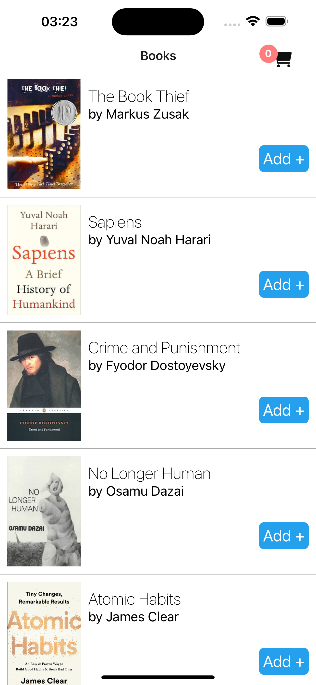
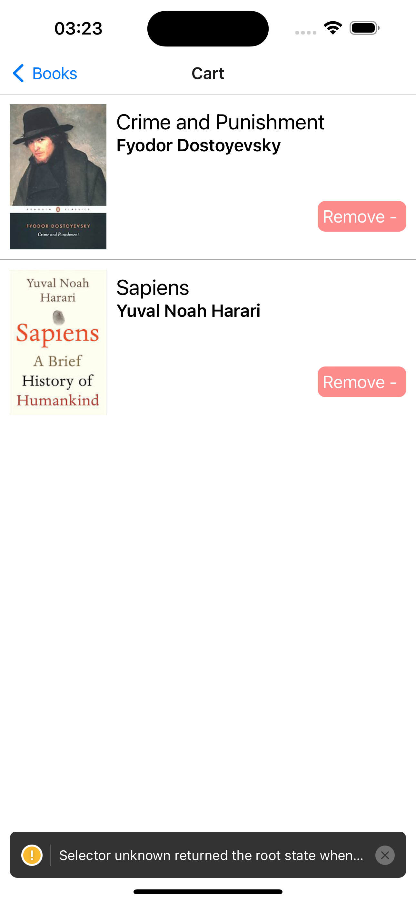

<h1>Book Seller Mobile App</h1>

Book Seller is a React Native mobile application designed to help users browse, search, and purchase books. It utilizes Redux for state management, React Navigation for seamless navigation between screens, and Vector Icons for an intuitive user interface.

<h3>🚀 Features </h3>

    •	Browse and search for books
    •	Detailed book descriptions
    •	Add books to a wishlist or cart
    •	Smooth navigation between screens
    •	Responsive design for both iOS and Android
    •	State management with Redux
    •	Customizable user interface with React Native Vector Icons

<h3>🛠️ Technologies </h3>

    •	React Native: Cross-platform mobile development framework.
    •	Redux: State management.
    •	React Navigation: Handle app navigation.
    •	React Native Vector Icons: Beautiful, customizable icons.

<h3>🔧 Usage </h3>

    •	Browse books in the catalog.
    •	Add books to your cart or wishlist.
    •	Use navigation to switch between screens like Home, Wishlist, Cart, and Details.
    •	Experience real-time state updates across the app thanks to Redux.

<h3>📸 Screenshots</h3>

<>
<>
<>
